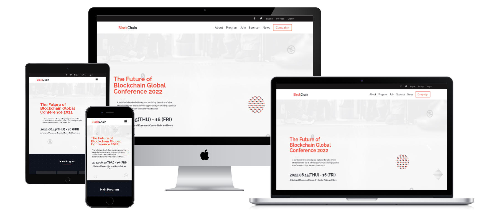

# capstone-project

## Description the project.

This is the first Microverse capstone project meant to summarize all the content learned through module 1. The objective was to mimic the appearance of a landing page, in a similar way a web developer would receive the requirements in a job.

## Built With

- HTML
- CSS
- Javascript
- Visual Studio Code
- Chrome Developer Tools
- following github flows standards.

## Getting Started

**My project works on mobile and disktop using @Media queries .**

To get a local copy up and run:

- git clone https://github.com/DuaneDave/Blockchain-Conference-first-capstone/tree/Wip-Feat in your terminal

### Prerequisites

- Git/Github
- VSCode or another equivalent tool
- knowledge in Html, Css and Javascript

### Install

- npm install -g @lhci/cli@0.7.x
- npm install --save-dev hint@6.x
- npm install --save-dev stylelint@13.x stylelint-scss@3.x stylelint-config-standard@21.x stylelint-csstree-validator@1.x

### Run the following tests:

- npx hint .
- npx stylelint "\*_/_.{css,scss}"
- npx eslint .

### Usage

You're free to use this project however you like it for educational purposes. Just keep in mind the acknowledgment described below

### LIVE DEMO

Check the live demo here [LINK](https://duanedave.github.io/Blockchain-Conference-first-capstone/)
[Project presentation](https://www.loom.com/share/4b86fc0ecbf64f799a5526eb17bd0654)

## Authors

👤 **OBIEBI OKIEMUTE DAVID**

- GitHub: [@githubhandle](https://github.com/DuaneDave)
- Twitter: [@twitterhandle](https://twitter.com/dave_duane)
- LinkedIn: [LinkedIn](https://www.linkedin.com/in/okiemute-david-obiebi-6b4a6a230/)

## 🤝 credit

[@Cindy Shin](https://www.behance.net/adagio07) Thanks for this amazing Design.

## 🤝 Contributing

Contributions, issues, and feature requests are welcome!

Feel free to check the [issues page](https://github.com/DuaneDave/Blockchain-Conference-first-capstone/issues).

## Show your support

Give a ⭐️ if you like this project!

## Acknowledgments

- Microverse
- Inspiration
- etc

## 📝 License

This Project Is Not licensed.
